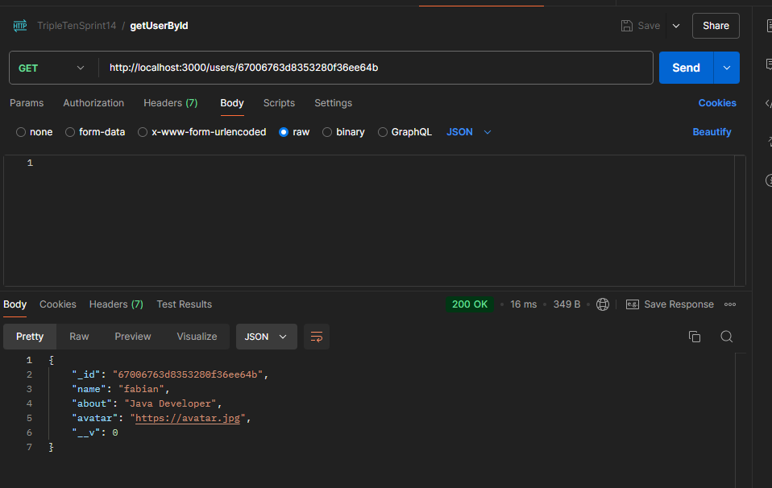

# Project Around Express

Es un proyecto backend que obtiene los datos necesarios para mostrar cartas e información del usuario.
Esto es para separar backend de front.

# Motivación

Actualmente cada usuario busca mostrar un poco mas de si mism@ através de redes sociales por lo que se genera este proyecto orientado a mostrar
hobbies, lugares que gustan al usuario, bandas de rock, etc.. con la finalidad de que otros usuarios den like a sus fotos.

# Caracteristicas del proyecto

Contiene un set de cartas con imagenes del usuario. Perfil editable. Nombre y Descripción general del usuario editables. Agregar cartas. Borrar cartas. Contador de likes.

# Tecnologías usadas en este proyecto

javascript, eslint, mongoDB

# Proceso del proyecto
1. Análisis del requerimiento.
2. Diseño de maquetación.
3. Implementación de código.
4. Pruebas.
5. Vobo usuario.

# Resultados
Este proyecto final tiene como resultado el mostrar una página web con las caracteristicas antes descritas y asi el usuario pueda usarla para mostrar sus imagenes favoritas con un nickname, descripción.

# Instrucciones para reproducir proyecto
1. Clonar repositorio.
2. Abrir en un IDE como Visual code.
3. para descargar dependencias: npm install
4. para ejecutar: npm start

# Evidencias de pruebas en postman

# Pruebas buscando un solo usuario

# Prueba para obtener todos los usuarios

# Prueba para obtener todas las cartas

# Prueba para crear cartas

